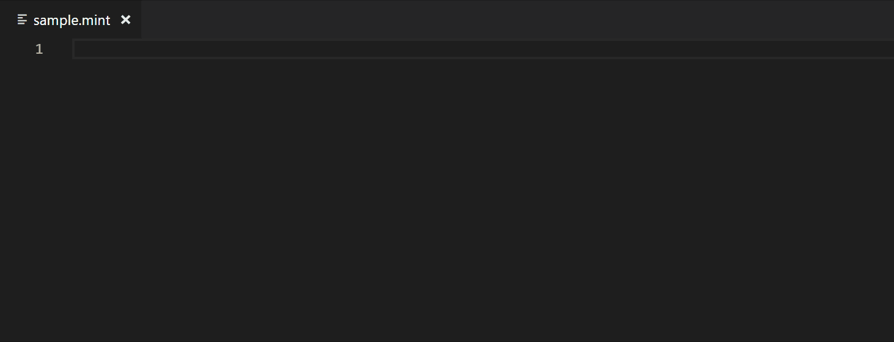

# Mint Language Support

This extension provides support for the Mint language.

## Features

+ Syntax highlighting for `.mint` files.
+ Snippets for function and variable declarations.

## The Mint language

More information on the Mint language itself can be found [on its GitHub page.](https://github.com/thomas-crane/mint)